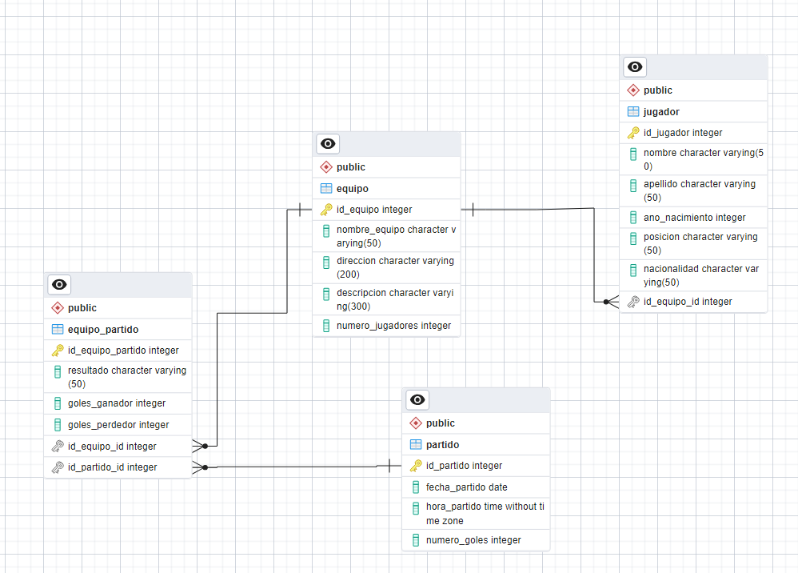

# Proyecto Primer Bimestre
## Aplicaciones Móviles
### Estudiante: Christian Nazate

## Historias de usuario
Las historias de usuario para el aplicativo movil se encuentran en el siguiente documento: [Ver Historias](HistoriasDeUsuario-ChristianNazate.pdf)

## Enlace al mockup
El mockup del aplicativo movil se encuentra en el siguiente enlace de Figma:
[Ver Mockup](https://www.figma.com/design/t3OJAveOEmRo7qF9IW8lHh/App-Wireframe?t=k5Y5scGJQNs8r6AP-1)

## Base de datos
El diagrama de la Base de datos se puede observar en la imagen a continuacion.

El script de creacion aproximado para el motor de bases de datos PostreSQL  se puede encontrar en: [Ver Script](BaseDeDatos\BDCreationScript.sql)
